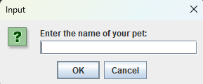
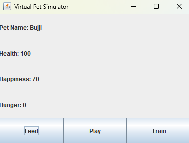
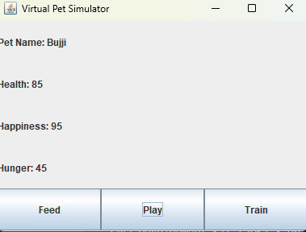

# Virtual Pet Simulator

Welcome to the Virtual Pet Simulator! This project is a simple Java Swing application where you can take care of a virtual pet. You can feed, play with, and train your pet, while keeping an eye on its health, happiness, and hunger levels.

## Features

- **Feed**: Decrease the pet's hunger and increase its health.
- **Play**: Increase the pet's happiness and hunger, but decrease its health slightly.
- **Train**: Increase the pet's health significantly, but decrease its happiness and increase its hunger.
- **Time Passage**: Every 5 seconds, the pet's hunger increases, and its health and happiness might decrease if it gets too hungry.

## Screenshots


<p><em>Initial screen when you start the application.</em></p>


<p><em>Screen after feeding the pet.</em></p>


<p><em>Screen after playing with the pet.</em></p>

## Getting Started

### Prerequisites

- Java Development Kit (JDK) 8 or later
- IntelliJ IDEA or any other Java IDE

### Installation

1. Clone the repository:
   ```bash
   git clone https://github.com/Manikanta-484/VirtualPetSimulator.git
## Running the Application

**Open the project in IntelliJ IDEA:**

1. Go to File -> Open and select the project directory.

**Running the Application:**

1. In IntelliJ IDEA, navigate to the `src` directory.
2. Open the Main class located in `com.virtualpet` package.
3. Right-click on the Main class and select Run 'Main.main()'.

## Usage

1. Enter a name for your pet when prompted.
2. Use the buttons to feed, play with, or train your pet.
3. Observe the pet's health, happiness, and hunger levels and try to keep your pet happy and healthy!

## Project Structure

- `Pet.java`: This class represents the virtual pet and contains its attributes and behaviors.
- `PetSimulator.java`: This class creates the GUI and handles user interactions.
- `Main.java`: This class contains the main method to start the application.
